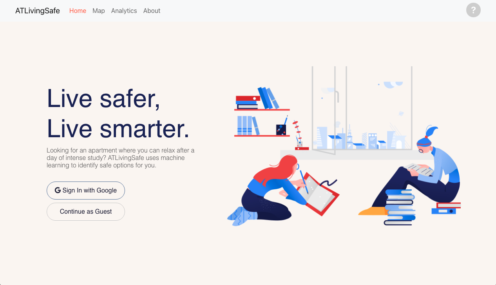

# ATLivingSafe

Please check out our website at <a href="https://murmuring-peak-84054.herokuapp.com/">ATLivingSafe.com</a>!

## Problem Definition

College students nowadays are facing increasing exposure to urban crimes. Various measures have been instituted by both campus and governmental authorities in recent years to enforce students’ safety. Our team believes that amidst general success, however, there remains a blind spot. The safety measure for students living off-campus largely depends on their living situation and its surroundings, but none of the existing apartment listing sites such as Apartments.com offer truly robust functionalities in this regard.  We attempt to take into account the fact that people’s safety is affected by their daily activities in the city as they travel to campuses, workplaces, local groceries, pharmacies, gyms and other entities. 


## Solution

The goal of our project is to create a more dynamically safety-oriented apartment listing site that considers each property listing not as a fixed location, but as a web of routes centered at the apartment building and expanding into the wider neighborhood. Put formally, for each apartment building within a user-defined radius, our application will compute a safety score by combining the safety score of its location and of all the routes between this building and user’s most frequented locations.

## Table of Content

* Description
* Getting Started
    * Prerequisites
    * Installation
* Usage
* Demo Video

## Description

???

## Getting Started

### Prerequisites

Please make sure you have `npm` and `node` installed on your machine. You can check by running:
```
npm -v
node -v
```

### Installation

1. Clone the depository by running the following lines in terminal:
    ```
    git clone https://github.com/gtfiveguys/atl-living-safe-00.git
    cd atl-living-safe-00
    ```

2. Install packages.

    Run the following line to install packages in the frontend:
    ```
    cd atl-living-safe-00/client
    npm install
    ```
    Run the following line to install packages in the backend:
    ```
    cd atl-living-safe-00/server
    npm install
    ```

3. Create your own access tokens.

    1. Google Maps APIs
        * Register a <a href="https://developers.google.com/">Google Developers account</a> if you do not have one already.
        * Create a Google API key on <a href="https://console.cloud.google.com/google/maps-apis/overview?project=empirical-oven-327821">Google Maps Platform</a> to be able to use <a href="https://developers.google.com/maps/documentation/javascript/overview">Maps JavaScript API</a>.
        * Store the **API key** on your local machine.
    2. MongoDB Database
        * Register a <a href="https://www.mongodb.com/cloud/atlas/register">MongoDB account</a> if you do not have one already.
        * Sign in to MongoDB Atlas and create a new cluster or use an existing one.
        * Go to "Database Access" under "SECURITY" in the left-hand side panel and **add a new database user**. This should be the admin who has full control over the database.
        * Go back to cluster, click "Connect" and copy the **connection string**. Make sure to replace any required variables. Store it on your local machine.
    3. Google Sign In
        * Go to the <a href="https://console.developers.google.com/apis/credentials">Credentials page</a> on Google Cloud Platform.
        * Click **Create credentials -> OAuth Client ID**.
        * Select the **Web application** application type.
        * Name your OAuth 2.0 client, add http://localhost:3000 to **Authorized JavaScript origins** and http://localhost:5000/auth/google/callback to **Authorized redirect URIs**, and click **Create**.
        * Copy and store **Client ID** and **Client secret** on your local machine.
        * Read more: <a href="https://developers.google.com/identity/sign-in/web/sign-in">Integrating Google Sign-In into your web app</a>.

## Usage

1. To start the frontend server:
    Paste the Google Maps API key you created earlier at `<Your Google Maps API key>`:
    ```
    export REACT_APP_GOOGLE_API_KEY=<Your Google Maps API key>
    ```
    In the same terminal window, run the following lines:
    ```
    cd atl-living-safe/client
    npm start
    ```
2. To start the backend server:
    Create a `config.env` file in the `atl-living-safe-00/server/config` folder and paste all other tokens you created earlier into it. **Please do NOT change the variable names.**
    ```
    PORT = 5000
    MONGO_URI = <MongoDB connection string>
    GOOGLE_CLIENT_ID = <Google Client ID>
    GOOGLE_CLIENT_SECRET = <Google Client secret>
    SESSION_SECRET = <anything you like>
    ```
    **Open a new terminal window** and run the following lines:
    ```
    cd atl-living-safe/server
    npm run dev
    ```
    You should now have two terminal windows, each running a server.

3. If `react-script` hasn't already opened a new page in your browser window, go to http://localhost:3000.

4. You're all set! 🎉


## Demo Video
[](https://youtu.be/GbHQXH1KCAI)
